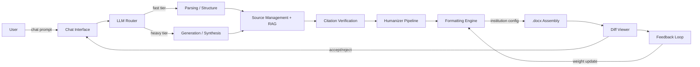
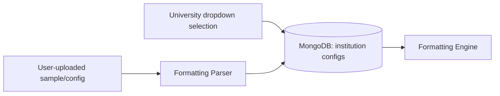

# Architecture & Flow Diagrams

## Update Policy
Update this file whenever a pipeline stage, data flow, or critical user workflow changes.
Diagrams here are the canonical reference; keep source files (if any) alongside their rendered
Mermaid block.

## Pipeline Flow (MVP)

## Data Flow: Institution Config

_(No diagrams exist yet beyond this MVP baseline — extend as epics are implemented.)_
