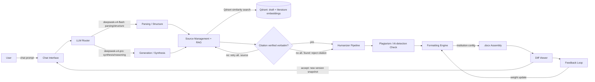
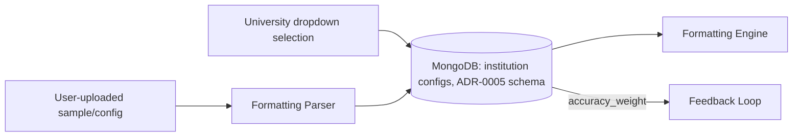
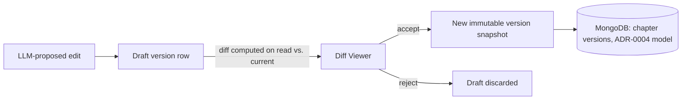

# Architecture & Flow Diagrams

## Update Policy
Update this file whenever a pipeline stage, data flow, or critical user workflow changes.
Diagrams here are the canonical reference; keep source files (if any) alongside their rendered
Mermaid block.

## Pipeline Flow (MVP)

See ADR-0001 (citation retry/reject contract), ADR-0002 (Qdrant), ADR-0003 (router policy).

## Data Flow: Institution Config

## Data Flow: Document Versioning & Diff Review

_(Baseline updated 2026-08-04 per ADR-0001 through ADR-0005; extend further as epics are
implemented and diverge from these assumptions.)_
